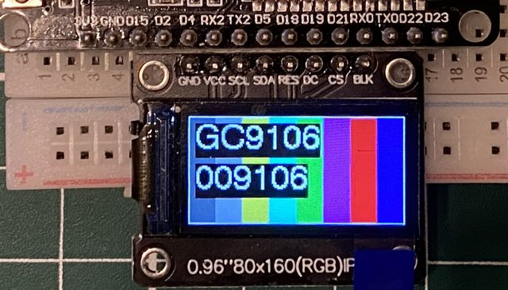
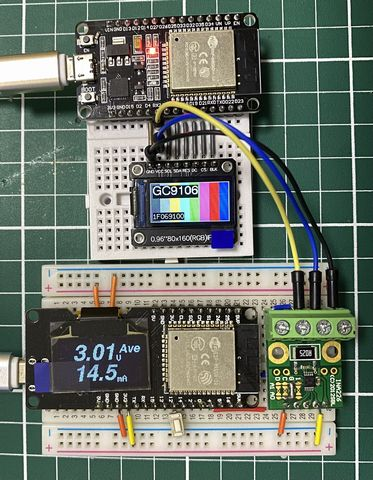

# ESP32_80x160_Display_AutoDetect

80x160ドットのディスプレイモジュールにおいて、正規のST7735ドライバでなくGC9106が搭載されている場合でも、LovyanGFXで利用できるようにしました。 

## 背景

AliExpressでST7735ドライバの0.96インチディスプレイを調達した際に、正しく動かないものが出てきた。 

ネットを調べていたら、下記のフォーラムにあるように、ST7735のクローンとしてGC9106が乗っているものが出回っているようです。 

https://forum.arduino.cc/t/cropped-80x160-display-st7735s-tft-espi/899248

LovyanGFXのパラメータ変更だけではうまく表示することができなかったので、Arduino_GFXの初期設定を取り込んで利用しようと考えました。

## 機能

LovyanGFXのAutoDetectを参考に、display IDをリードして、下位24bitが0x069100と一致するかを見てGC9106と判断します。 

利用環境に合わせて、ディスプレイとの接続ピンの指定（DISP_XXXの定義）を変更してください。 

ソースコードはDOIT ESP32 DEVKITを使用して、写真のように直結した状態を想定しています。 

## 注意

直結して使用する場合は十分な配慮が必要です。 

マイコンボードの回路やGPIOポートの能力を十分確認して、自己責任で使用してください。 
＃ピン配置に影響を受けずに、使用できる組み合わせは少ないと思われます。 

特に、GPIOポートから電力を供給する場合は、ポートの能力だけでなく、ディスプレイの消費電力と電源やCPUの供給量力とを見極めて使用してください。 

ST7735の消費電流が10mA未満に対し、GC9106は15mA程度消費するようです。 

